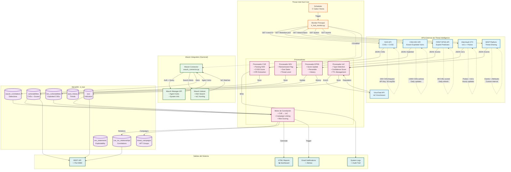

```mermaid
graph TB
    %% Estilos
    classDef api fill:#e1f5fe,stroke:#01579b,stroke-width:2px
    classDef internal fill:#fff3e0,stroke:#e65100,stroke-width:2px
    classDef database fill:#f3e5f5,stroke:#4a148c,stroke-width:2px
    classDef wazuh fill:#e8f5e9,stroke:#1b5e20,stroke-width:2px
    classDef process fill:#fce4ec,stroke:#880e4f,stroke-width:2px
    classDef output fill:#e0f2f1,stroke:#004d40,stroke-width:2px

    %% APIs Externas
    subgraph "APIs Externas de Threat Intelligence"
        NVD[NVD API<br/>CVEs + CVSS]:::api
        KEV[CISA KEV API<br/>Known Exploited Vulns]:::api
        EPSS[FIRST EPSS API<br/>Exploit Prediction]:::api
        OTX[AlienVault OTX<br/>IoCs + Pulsos]:::api
        MISP[MISP Platform<br/>Threat Sharing]:::api
        VT[VirusTotal API<br/>IoC Enrichment]:::api
    end

    %% Sistema Central
    subgraph "Threat Intel Hub Core"
        SCHED[Scheduler<br/>⏰ Cada 4 horas]:::internal
        MONITOR[Monitor Principal<br/>ti_hub_monitor.py]:::internal
        
        subgraph "Procesadores"
            PROC_CVE[Procesador CVE<br/>• Parsing NVD<br/>• CVSS Score<br/>• CPE Extraction]:::process
            PROC_KEV[Procesador KEV<br/>• Ransomware Flag<br/>• Due Dates<br/>• Threat Level]:::process
            PROC_EPSS[Procesador EPSS<br/>• Score Update<br/>• Percentile<br/>• History]:::process
            PROC_IOC[Procesador IoC<br/>• Type Detection<br/>• Confidence Score<br/>• TTL Management]:::process
            CORR[Motor de Correlación<br/>• CVE ↔ IoC<br/>• Campaign Linking<br/>• Risk Scoring]:::process
        end
    end

    %% Wazuh Integration
    subgraph "Wazuh Integration (Opcional)"
        WAZ_MGR[Wazuh Manager API<br/>• Agent Vulns<br/>• System Info]:::wazuh
        WAZ_IDX[Wazuh Indexer<br/>• Alert Search<br/>• IoC Hunting]:::wazuh
        WAZ_CONN[Wazuh Connector<br/>wazuh_connector.py]:::wazuh
    end

    %% Base de Datos
    subgraph "MariaDB - ti_hub"
        DB_CVE[(vulnerabilities<br/>CVEs + Scores)]:::database
        DB_KEV[(kev_vulnerabilities<br/>Exploited CVEs)]:::database
        DB_IOC[(iocs<br/>Indicators)]:::database
        DB_REL[(cve_ioc_relationships<br/>Correlations)]:::database
        DB_CAMP[(threat_campaigns<br/>APT Groups)]:::database
        DB_WAZ[(wazuh_correlations<br/>Detections)]:::database
        DB_EPSS[(epss_history<br/>Trends)]:::database
        DB_VEX[(vex_statements<br/>Exploitability)]:::database
    end

    %% Outputs
    subgraph "Salidas del Sistema"
        EMAIL[Email Notifications<br/>📧 Alertas]:::output
        REPORT[HTML Reports<br/>📊 Dashboard]:::output
        LOGS[System Logs<br/>📝 Audit Trail]:::output
        API_REST[REST API<br/>🔌 Port 8080]:::output
    end

    %% Flujos de Datos Principales
    SCHED -->|Trigger| MONITOR
    
    %% Flujo NVD
    MONITOR -->|GET /cves/2.0| NVD
    NVD -->|JSON: CVEs| PROC_CVE
    PROC_CVE -->|Store| DB_CVE
    
    %% Flujo KEV
    MONITOR -->|GET /feeds/kev.json| KEV
    KEV -->|JSON: Exploited| PROC_KEV
    PROC_KEV -->|Store| DB_KEV
    
    %% Flujo EPSS
    MONITOR -->|GET /data/v1/epss| EPSS
    EPSS -->|JSON: Scores| PROC_EPSS
    PROC_EPSS -->|Update| DB_CVE
    PROC_EPSS -->|History| DB_EPSS
    
    %% Flujo OTX
    MONITOR -->|GET /pulses| OTX
    OTX -->|JSON: IoCs| PROC_IOC
    
    %% Flujo MISP
    MONITOR -->|GET /events| MISP
    MISP -->|JSON: Events| PROC_IOC
    
    %% Flujo VirusTotal
    PROC_IOC -->|Enrich| VT
    VT -->|Reputation| PROC_IOC
    
    %% Almacenamiento IoCs
    PROC_IOC -->|Store| DB_IOC
    
    %% Correlación
    DB_CVE --> CORR
    DB_IOC --> CORR
    DB_KEV --> CORR
    CORR -->|Relations| DB_REL
    CORR -->|Campaigns| DB_CAMP
    
    %% Wazuh Flow
    MONITOR -.->|If Enabled| WAZ_CONN
    WAZ_CONN -->|Auth + Query| WAZ_MGR
    WAZ_CONN -->|Search Alerts| WAZ_IDX
    WAZ_MGR -->|Agent Vulns| WAZ_CONN
    WAZ_IDX -->|IoC Matches| WAZ_CONN
    WAZ_CONN -->|Store| DB_WAZ
    DB_WAZ --> CORR
    
    %% Outputs
    CORR -->|Generate| REPORT
    CORR -->|Trigger| EMAIL
    MONITOR -->|Write| LOGS
    DB_CVE --> API_REST
    DB_IOC --> API_REST
    DB_REL --> API_REST

    %% Notas sobre datos
    NVD -.->|"200 CVEs/request<br/>API Key: 50 req/30s"| NVD
    KEV -.->|"~1000 CVEs activos<br/>Daily updates"| KEV
    EPSS -.->|"All CVEs scored<br/>Daily refresh"| EPSS
    OTX -.->|"Pulses + IoCs<br/>Hourly updates"| OTX
    MISP -.->|"Events + Attributes<br/>Custom interval"| MISP
```
