```mermaid
graph TB
    %% Estilos
    classDef api fill:#e1f5fe,stroke:#01579b,stroke-width:2px
    classDef internal fill:#fff3e0,stroke:#e65100,stroke-width:2px
    classDef database fill:#f3e5f5,stroke:#4a148c,stroke-width:2px
    classDef wazuh fill:#e8f5e9,stroke:#1b5e20,stroke-width:2px
    classDef process fill:#fce4ec,stroke:#880e4f,stroke-width:2px
    classDef output fill:#e0f2f1,stroke:#004d40,stroke-width:2px

    %% APIs Externas
    subgraph "APIs Externas de Threat Intelligence"
        NVD[NVD API<br/>CVEs + CVSS]:::api
        KEV[CISA KEV API<br/>Known Exploited Vulns]:::api
        EPSS[FIRST EPSS API<br/>Exploit Prediction]:::api
        OTX[AlienVault OTX<br/>IoCs + Pulsos]:::api
        MISP[MISP Platform<br/>Threat Sharing]:::api
        VT[VirusTotal API<br/>IoC Enrichment]:::api
    end

    %% Sistema Central
    subgraph "Threat Intel Hub Core"
        SCHED[Scheduler<br/>⏰ Cada 4 horas]:::internal
        MONITOR[Monitor Principal<br/>ti_hub_monitor.py]:::internal
        
        subgraph "Procesadores"
            PROC_CVE[Procesador CVE<br/>• Parsing NVD<br/>• CVSS Score<br/>• CPE Extraction]:::process
            PROC_KEV[Procesador KEV<br/>• Ransomware Flag<br/>• Due Dates<br/>• Threat Level]:::process
            PROC_EPSS[Procesador EPSS<br/>• Score Update<br/>• Percentile<br/>• History]:::process
            PROC_IOC[Procesador IoC<br/>• Type Detection<br/>• Confidence Score<br/>• TTL Management]:::process
            CORR[Motor de Correlación<br/>• CVE ↔ IoC<br/>• Campaign Linking<br/>• Risk Scoring]:::process
        end
    end

    %% Wazuh Integration
    subgraph "Wazuh Integration (Opcional)"
        WAZ_MGR[Wazuh Manager API<br/>• Agent Vulns<br/>• System Info]:::wazuh
        WAZ_IDX[Wazuh Indexer<br/>• Alert Search<br/>• IoC Hunting]:::wazuh
        WAZ_CONN[Wazuh Connector<br/>wazuh_connector.py]:::wazuh
    end

    %% Base de Datos
    subgraph "MariaDB - ti_hub"
        DB_CVE[(vulnerabilities<br/>CVEs + Scores)]:::database
        DB_KEV[(kev_vulnerabilities<br/>Exploited CVEs)]:::database
        DB_IOC[(iocs<br/>Indicators)]:::database
        DB_REL[(cve_ioc_relationships<br/>Correlations)]:::database
        DB_CAMP[(threat_campaigns<br/>APT Groups)]:::database
        DB_WAZ[(wazuh_correlations<br/>Detections)]:::database
        DB_EPSS[(epss_history<br/>Trends)]:::database
        DB_VEX[(vex_statements<br/>Exploitability)]:::database
    end

    %% Outputs
    subgraph "Salidas del Sistema"
        EMAIL[Email Notifications<br/>📧 Alertas]:::output
        REPORT[HTML Reports<br/>📊 Dashboard]:::output
        LOGS[System Logs<br/>📝 Audit Trail]:::output
        API_REST[REST API<br/>🔌 Port 8080]:::output
    end

    %% Flujos de Datos Principales
    SCHED -->|Trigger| MONITOR
    
    %% Flujo NVD
    MONITOR -->|GET /cves/2.0| NVD
    NVD -->|JSON: CVEs| PROC_CVE
    PROC_CVE -->|Store| DB_CVE
    
    %% Flujo KEV
    MONITOR -->|GET /feeds/kev.json| KEV
    KEV -->|JSON: Exploited| PROC_KEV
    PROC_KEV -->|Store| DB_KEV
    
    %% Flujo EPSS
    MONITOR -->|GET /data/v1/epss| EPSS
    EPSS -->|JSON: Scores| PROC_EPSS
    PROC_EPSS -->|Update| DB_CVE
    PROC_EPSS -->|History| DB_EPSS
    
    %% Flujo OTX
    MONITOR -->|GET /pulses| OTX
    OTX -->|JSON: IoCs| PROC_IOC
    
    %% Flujo MISP
    MONITOR -->|GET /events| MISP
    MISP -->|JSON: Events| PROC_IOC
    
    %% Flujo VirusTotal
    PROC_IOC -->|Enrich| VT
    VT -->|Reputation| PROC_IOC
    
    %% Almacenamiento IoCs
    PROC_IOC -->|Store| DB_IOC
    
    %% Correlación
    DB_CVE --> CORR
    DB_IOC --> CORR
    DB_KEV --> CORR
    CORR -->|Relations| DB_REL
    CORR -->|Campaigns| DB_CAMP
    
    %% Wazuh Flow
    MONITOR -.->|If Enabled| WAZ_CONN
    WAZ_CONN -->|Auth + Query| WAZ_MGR
    WAZ_CONN -->|Search Alerts| WAZ_IDX
    WAZ_MGR -->|Agent Vulns| WAZ_CONN
    WAZ_IDX -->|IoC Matches| WAZ_CONN
    WAZ_CONN -->|Store| DB_WAZ
    DB_WAZ --> CORR
    
    %% Outputs
    CORR -->|Generate| REPORT
    CORR -->|Trigger| EMAIL
    MONITOR -->|Write| LOGS
    DB_CVE --> API_REST
    DB_IOC --> API_REST
    DB_REL --> API_REST

    %% Notas sobre datos
    NVD -.->|"200 CVEs/request<br/>API Key: 50 req/30s"| NVD
    KEV -.->|"~1000 CVEs activos<br/>Daily updates"| KEV
    EPSS -.->|"All CVEs scored<br/>Daily refresh"| EPSS
    OTX -.->|"Pulses + IoCs<br/>Hourly updates"| OTX
    MISP -.->|"Events + Attributes<br/>Custom interval"| MISP
```

# Threat Intel Hub - Arquitectura y Flujo de Datos

## Descripción General

Threat Intel Hub es una plataforma centralizada de inteligencia de amenazas que recolecta, correlaciona y analiza información de múltiples fuentes para proporcionar una vista unificada del panorama de amenazas.

## Arquitectura del Sistema

```
┌─────────────────────────────────────────────────────────────────┐
│                     APIs Externas (Threat Intel)                │
├─────────────────────────────────────────────────────────────────┤
│  NVD │ CISA KEV │ EPSS │ AlienVault OTX │ MISP │ VirusTotal   │
└──────┬──────────────────────────────────────────────────────────┘
       │
       ▼
┌─────────────────────────────────────────────────────────────────┐
│                    Threat Intel Hub Core                        │
│  ┌──────────────┐    ┌──────────────┐    ┌──────────────┐     │
│  │  Scheduler   │───▶│   Monitor    │───▶│ Procesadores │     │
│  │  (4 horas)   │    │   Principal  │    │   de Datos   │     │
│  └──────────────┘    └──────────────┘    └──────────────┘     │
│                              │                                  │
│                              ▼                                  │
│                    ┌──────────────────┐                        │
│                    │ Motor Correlación│                        │
│                    │   CVE ↔ IoC     │                        │
│                    └──────────────────┘                        │
└─────────────────────────────┬───────────────────────────────────┘
                              │
       ┌──────────────────────┼──────────────────────┐
       ▼                      ▼                      ▼
┌──────────────┐    ┌──────────────┐    ┌──────────────────┐
│   MariaDB    │    │    Wazuh     │    │    Salidas      │
│   Database   │    │ (Opcional)   │    │ Email/Reports   │
└──────────────┘    └──────────────┘    └──────────────────┘
```

## Flujos de Datos Detallados

### Diagrama de flujo



### 1. Recolección de Vulnerabilidades (CVE)

#### Fuente: NVD (National Vulnerability Database)
- **Endpoint**: `https://services.nvd.nist.gov/rest/json/cves/2.0`
- **Frecuencia**: Cada 4 horas
- **Límites de API**:
  - Sin API Key: 5 requests/30 segundos
  - Con API Key: 50 requests/30 segundos
- **Datos Recolectados**:
  ```json
  {
    "cve_id": "CVE-2024-12345",
    "published_date": "2024-01-15T10:00:00",
    "last_modified": "2024-01-16T15:30:00",
    "description": "Descripción de la vulnerabilidad",
    "cvss_v3": {
      "base_score": 7.5,
      "severity": "HIGH",
      "vector_string": "CVSS:3.1/AV:N/AC:L/PR:N/UI:N/S:U/C:H/I:N/A:N"
    },
    "cpe_list": ["cpe:2.3:a:vendor:product:version:*:*:*:*:*:*:*"],
    "references": ["https://example.com/advisory"]
  }
  ```
- **Volumen Esperado**: 200-500 CVEs por ciclo
- **Almacenamiento**: Tabla `vulnerabilities`

### 2. Vulnerabilidades Explotadas Activamente (KEV)

#### Fuente: CISA Known Exploited Vulnerabilities
- **Endpoint**: `https://www.cisa.gov/sites/default/files/feeds/known_exploited_vulnerabilities.json`
- **Frecuencia**: Cada 4 horas
- **Datos Recolectados**:
  ```json
  {
    "cve_id": "CVE-2024-12345",
    "vendor_project": "Microsoft",
    "product": "Exchange Server",
    "vulnerability_name": "Remote Code Execution",
    "date_added": "2024-01-15",
    "short_description": "Permite ejecución remota de código",
    "required_action": "Aplicar parche inmediatamente",
    "due_date": "2024-02-01",
    "known_ransomware_campaign_use": "Known"
  }
  ```
- **Volumen Esperado**: ~1,000-1,500 CVEs totales, 10-20 nuevos por semana
- **Almacenamiento**: Tabla `kev_vulnerabilities`
- **Importancia**: CVEs confirmados siendo explotados en el mundo real

### 3. Predicción de Explotación (EPSS)

#### Fuente: FIRST EPSS (Exploit Prediction Scoring System)
- **Endpoint**: `https://api.first.org/data/v1/epss`
- **Frecuencia**: Cada 4 horas
- **Datos Recolectados**:
  ```json
  {
    "cve": "CVE-2024-12345",
    "epss": 0.00456,
    "percentile": 0.85432,
    "date": "2024-01-15"
  }
  ```
- **Interpretación de Scores**:
  - `epss`: Probabilidad de explotación (0-1)
    - 0.00-0.10: Baja probabilidad
    - 0.10-0.40: Media probabilidad
    - 0.40-1.00: Alta probabilidad
  - `percentile`: Ranking comparativo (0-1)
    - 0.90 = Top 10% más probable de ser explotado
- **Volumen**: Actualización para todos los CVEs conocidos
- **Almacenamiento**: 
  - Score actual en tabla `vulnerabilities`
  - Histórico en tabla `epss_history`

### 4. Indicadores de Compromiso (IoCs)

#### Fuente: AlienVault OTX
- **Endpoint**: `https://otx.alienvault.com/api/v1/pulses`
- **Frecuencia**: Cada 4 horas
- **Datos Recolectados**:
  ```json
  {
    "pulse_id": "pulse_123456",
    "name": "APT29 Campaign",
    "indicators": [
      {
        "indicator": "192.168.1.100",
        "type": "IPv4",
        "title": "C2 Server"
      },
      {
        "indicator": "malware.evil.com",
        "type": "domain",
        "title": "Malware distribution"
      },
      {
        "indicator": "d41d8cd98f00b204e9800998ecf8427e",
        "type": "FileHash-MD5",
        "title": "Malware sample"
      }
    ]
  }
  ```
- **Tipos de IoCs**:
  - IPv4/IPv6 addresses
  - Dominios y URLs
  - File hashes (MD5, SHA1, SHA256)
  - Email addresses
  - Mutex names
  - Registry keys
- **Volumen Esperado**: 100-1,000 IoCs por ciclo

#### Fuente: MISP
- **Endpoint**: `{MISP_URL}/events`
- **Frecuencia**: Cada 6 horas (configurable)
- **Datos Recolectados**:
  - Eventos completos con atributos
  - Campañas y atribución a threat actors
  - TTPs (Tactics, Techniques, Procedures)
  - Relaciones entre IoCs
- **Filtros Aplicados**:
  - Solo eventos publicados (opcional)
  - Nivel de distribución configurado
  - Organización específica

#### Fuente: VirusTotal (Enriquecimiento)
- **Endpoint**: `https://www.virustotal.com/api/v3/`
- **Uso**: Enriquecimiento de IoCs existentes
- **Límites**: 4 requests/minuto (API gratuita)
- **Datos Obtenidos**:
  - Reputación de IPs/dominios
  - Detecciones de antivirus para hashes
  - Relaciones con otros IoCs

### 5. Integración con Wazuh (Opcional)

#### Wazuh Manager API
- **Endpoint**: `{WAZUH_URL}/agents/{agent_id}/vulnerabilities`
- **Frecuencia**: Cada 30 minutos
- **Datos Recolectados**:
  ```json
  {
    "agent_id": "001",
    "agent_name": "web-server-01",
    "vulnerabilities": [
      {
        "cve": "CVE-2024-12345",
        "severity": "High",
        "package": "apache2",
        "version": "2.4.41"
      }
    ]
  }
  ```

#### Wazuh Indexer (OpenSearch)
- **Endpoint**: `{WAZUH_INDEXER}/wazuh-alerts-*/_search`
- **Búsqueda**: IoCs en logs de los últimos 7 días
- **Query Example**:
  ```json
  {
    "query": {
      "bool": {
        "should": [
          {"wildcard": {"data.srcip": "*192.168.1.100*"}},
          {"wildcard": {"data.url": "*malware.evil.com*"}},
          {"wildcard": {"full_log": "*d41d8cd98f00b204*"}}
        ]
      }
    },
    "size": 1000
  }
  ```
- **Correlación**: Matching de IoCs con eventos de seguridad

## Proceso de Correlación

### Motor de Correlación Central

El sistema correlaciona datos mediante las siguientes relaciones:

#### 1. CVE ↔ IoC
- **Tabla**: `cve_ioc_relationships`
- **Tipos de Relación**:
  - `exploits_vulnerability`: IoC explota directamente el CVE
  - `associated_malware`: Malware relacionado con el CVE
  - `exploitation_tool`: Herramienta que explota el CVE
  - `post_exploitation`: Actividad post-explotación

#### 2. CVE ↔ KEV
- **Correlación Directa**: CVE presente en ambas fuentes
- **Enriquecimiento**: KEV añade contexto de explotación activa
- **Priorización**: CVEs en KEV tienen prioridad crítica

#### 3. IoC ↔ Wazuh
- **Detección**: IoCs encontrados en logs de Wazuh
- **Tabla**: `wazuh_correlations`
- **Información Guardada**:
  - Agent ID y nombre
  - Timestamp de detección
  - Regla que generó la alerta
  - Contexto completo del evento

#### 4. Scoring Compuesto
```python
composite_risk_score = calculate_risk(
    cvss_score,        # Severidad base
    epss_score,        # Probabilidad de explotación
    is_kev,            # ¿Está en KEV?
    ioc_count,         # Cantidad de IoCs asociados
    wazuh_detections   # Detecciones en infraestructura
)
```

## Volumen de Datos y Performance

### Estimaciones de Volumen

| Componente | Registros Iniciales | Crecimiento Diario | Retención |
|------------|-------------------|-------------------|-----------|
| CVEs | 200,000+ | 50-100 | Permanente |
| KEV | 1,000-1,500 | 2-5 | Permanente |
| EPSS Scores | 200,000+ | Actualizaciones | 90 días histórico |
| IoCs | 10,000-50,000 | 500-2,000 | 90 días (configurable) |
| Wazuh Correlations | Variable | 100-10,000 | 30 días |
| Threat Campaigns | 100-500 | 1-5 | Permanente |

### Optimización de Consultas

#### Índices Críticos
```sql
-- Para búsquedas rápidas de CVE
INDEX idx_cve_id (cve_id)
INDEX idx_severity (cvss_severity)
INDEX idx_epss_score (epss_score)

-- Para correlaciones
INDEX idx_type_target (correlation_type, target_id)
INDEX idx_timestamp (timestamp)

-- Para IoCs
INDEX idx_indicator_type (indicator_type)
INDEX idx_confidence (confidence_score)
```

## Salidas del Sistema

### 1. Notificaciones por Email
- **Trigger**: Nuevas vulnerabilidades críticas o detecciones
- **Contenido**:
  - Resumen de CVEs críticos
  - KEV nuevos
  - IoCs detectados en Wazuh
  - Estadísticas del período

### 2. Reportes HTML
- **Generación**: Cada ciclo de monitoreo
- **Ubicación**: `/var/lib/threat-intel-hub/reports/`
- **Contenido**:
  - Dashboard ejecutivo
  - Top 10 amenazas
  - Tendencias EPSS
  - Detecciones Wazuh

### 3. API REST
- **Puerto**: 8080
- **Endpoints Principales**:
  ```
  GET /api/v1/vulnerabilities
  GET /api/v1/iocs
  GET /api/v1/correlations
  GET /api/v1/campaigns
  POST /api/v1/search
  ```

### 4. Logs del Sistema
- **Ubicación**: `/var/log/threat-intel-hub/`
- **Rotación**: Diaria, 30 días retención
- **Niveles**: INFO, WARNING, ERROR, CRITICAL

## Configuración y Tuning

### Intervalos Recomendados

| Proceso | Intervalo Mínimo | Recomendado | Máximo |
|---------|-----------------|-------------|---------|
| NVD Check | 1 hora | 4 horas | 24 horas |
| KEV Sync | 1 hora | 4 horas | 24 horas |
| EPSS Update | 4 horas | 12 horas | 24 horas |
| IoC Collection | 30 min | 4 horas | 12 horas |
| Wazuh Correlation | 15 min | 30 min | 2 horas |

### Consideraciones de Performance

1. **API Rate Limiting**:
   - NVD: Respetar límites (50 req/30s con key)
   - VirusTotal: 4 req/minuto (plan gratuito)
   - OTX/MISP: Según configuración del servidor

2. **Database Optimization**:
   - Particionamiento por fecha para tablas grandes
   - Archivado de datos antiguos
   - Índices en campos de búsqueda frecuente

3. **Memory Management**:
   - Procesamiento por lotes de 1000 registros
   - Limpieza de caché cada 24 horas
   - Límite de IoCs activos configurable

## Casos de Uso

### 1. Detección de Vulnerabilidad Crítica Explotada
```
CVE publicado → Aparece en KEV → Alto EPSS score → 
IoCs asociados detectados → Alerta en Wazuh → 
Notificación inmediata al equipo
```

### 2. Hunting Proactivo
```
Nueva campaña APT en OTX → IoCs importados → 
Búsqueda retrospectiva en Wazuh (7 días) → 
Identificación de compromisos no detectados
```

### 3. Priorización de Parcheo
```
CVEs en sistemas → Filtrar por KEV → 
Ordenar por EPSS score → 
Verificar detecciones Wazuh → 
Plan de parcheo priorizado
```

## Mantenimiento y Monitoreo

### Métricas Clave (KPIs)
- CVEs nuevos por día
- Porcentaje de CVEs en KEV
- IoCs únicos activos
- Correlaciones CVE-IoC
- Detecciones Wazuh por período
- Tiempo de respuesta API

### Tareas de Mantenimiento
- **Diario**: Revisar logs de errores
- **Semanal**: Verificar sincronización de fuentes
- **Mensual**: Limpieza de IoCs antiguos
- **Trimestral**: Optimización de índices DB

## Conclusión

Threat Intel Hub proporciona una plataforma integral para la gestión de inteligencia de amenazas, combinando múltiples fuentes de datos con capacidades de correlación avanzadas y detección en tiempo real a través de Wazuh, permitiendo una respuesta proactiva ante las amenazas emergentes.


